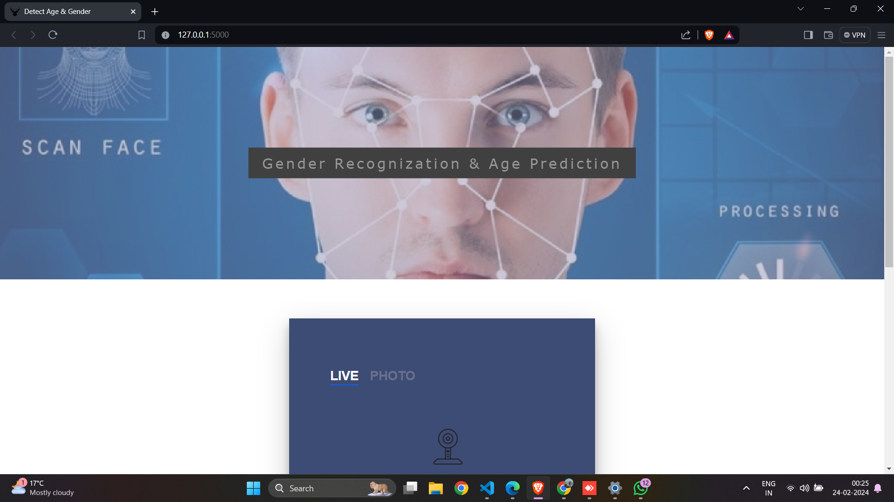
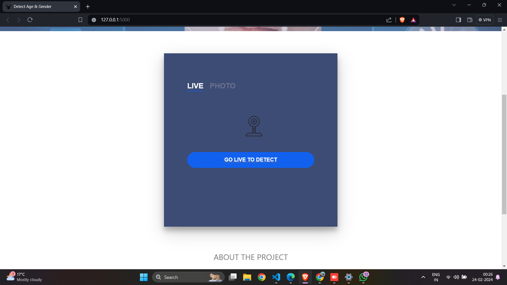
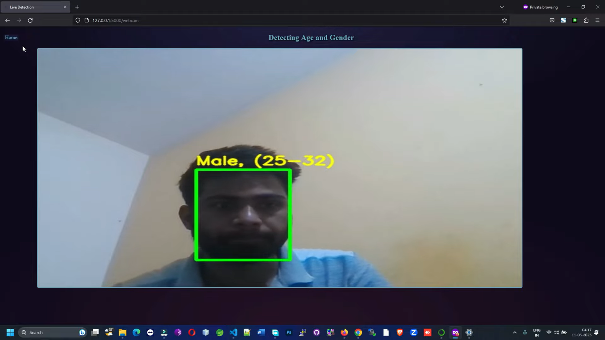

# Age and Gender Prediction Project

## Table of Contents

- [About Project](#about-project)
- [Purpose](#purpose)
- [Project Objectives](#project-objectives)
- [Interface](#interface)
- [Hardware & Software Requirement](#hardware--software-requirement)
- [Problem Description](#problem-description)
- [Literature Survey](#literature-survey)
- [Software Requirements Specification](#software-requirements-specification)
- [Conclusion & Future Work](#conclusion--future-work)

## About Project

The Age and Gender Prediction project utilizes deep learning techniques to predict individuals' age and gender accurately from images. It addresses the growing need for personalized user experiences in various domains like marketing and security. By employing convolutional neural networks (CNNs), the project aims to achieve high accuracy and robustness in demographic prediction, making it accessible via a user-friendly web interface powered by Flask.

This project emphasizes visualization and interactivity, democratizing access to advanced machine learning capabilities. Educational resources and documentation accompany the system, fostering understanding of complex algorithms and ethical considerations in AI development. Ethical concerns are paramount, with measures implemented to mitigate biases and promote fairness in prediction algorithms.

## Purpose

Developing an innovative deep learning system to accurately predict age and gender from images, fostering understanding of AI and web deployment techniques, and inspiring curiosity in the intersection of technology and demographics. In addition to its technical and educational objectives, this project aspires to instigate broader conversations about the societal implications of demographic prediction technology. By delving into topics such as privacy, bias, and the responsible use of AI, it aims to foster critical thinking and ethical awareness among stakeholders. Furthermore, by showcasing the potential of AI to positively impact various domains, including marketing, healthcare, and security, the project seeks to inspire interdisciplinary collaboration and innovation. Through its multifaceted approach, this project endeavors to not only advance the field of AI but also contribute to the creation of a more informed and conscientious society.

## Project Objectives

Following objectives should be achieved:

- Develop a deep learning model capable of accurately predicting age and gender from input images, leveraging techniques such as convolutional neural networks (CNNs) and transfer learning.
- Implement a user-friendly web interface using Flask for easy access and interaction with the trained model, facilitating intuitive visualization and exploration of demographic predictions.
- Address ethical considerations by mitigating biases and promoting fairness in age and gender prediction algorithms, while also providing educational resources to foster understanding of AI principles and ethical AI development practices.
- Train the model on diverse datasets to ensure robustness and generalization.
- Document the development process and create educational resources to demystify AI concepts.
- Explore ethical considerations in AI development, particularly regarding bias mitigation and fairness.
- Foster understanding of the intersection between technology and demographics.
- Inspire curiosity and critical thinking about the societal implications of demographic prediction technology.
- Encourage interdisciplinary collaboration and innovation in AI research and application.

## Interface

.
.
.

## Hardware & Software Requirement

### Software Requirements

#### For Developers:

- **IDE –Visual Studio Code**: Visual Studio Code is a source-code editor made by Microsoft for Windows, Linux, and macOS. Features include support for debugging, syntax highlighting, intelligent code completion, snippets, code refactoring, and embedded Git.
- **Programming Language**:
  - **HTML**: The Hyper Text Markup Language, or HTML, is the standard markup language for documents designed to be displayed in a web browser.
  - **CSS**: Cascading Style Sheets (CSS) is a style sheet language used for describing the presentation of a document written in a markup language such as HTML.
- **Web Browser - Google Chrome (for testing purpose)**: Google Chrome is a cross-platform web browser developed by Google.
- **Flask Framework**: Flask is a micro web framework written in Python.

#### For End-Users:
- Web Browser like Google Chrome (Latest Version) or Microsoft Edge (Latest Version)
- Internet Connectivity

### Hardware Requirement

- **Processor**: Dual-core 64-bit processor.
- **RAM**: 8 GB.
- **Hard Disk**: 4 GB.

## Problem Description

### Overview

- **The Need for Accurate Age and Gender Prediction**: Accurately predicting age and gender from images is crucial across various domains, including marketing, e-commerce, and security. In marketing and e-commerce, personalized user experiences and targeted content delivery can significantly enhance customer engagement and satisfaction. Understanding the demographics of users enables businesses to tailor their products and services more effectively, leading to increased sales and customer loyalty. Additionally, in security applications, such as surveillance systems, the ability to accurately identify individuals' age and gender can aid in law enforcement efforts and enhance public safety.
- **Challenges with Existing Methods**: While age and gender prediction from images are essential, existing methods may suffer from limitations in accuracy and robustness. Traditional approaches often rely on simplistic feature extraction techniques or manually crafted rules, which may not capture the subtle variations in facial characteristics that determine age and gender. Moreover, these methods may introduce biases and ethical concerns, particularly when dealing with diverse populations or sensitive demographic attributes. Biases in demographic
